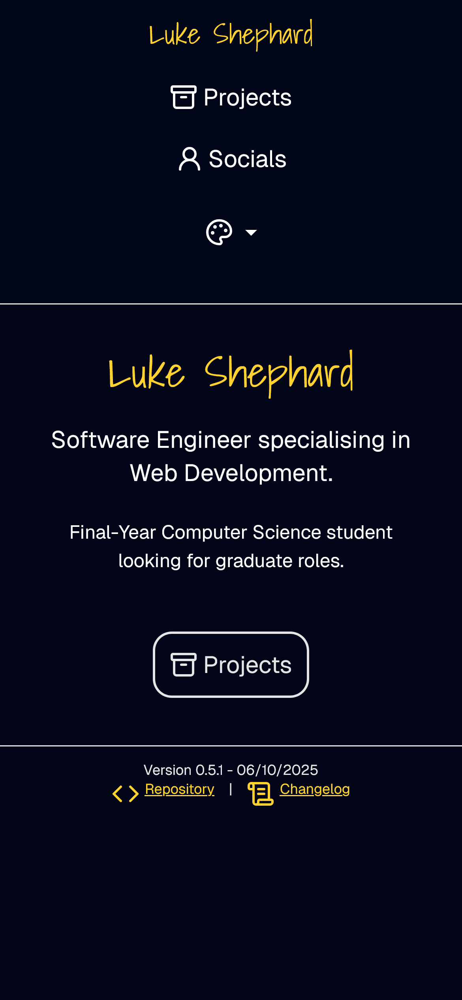
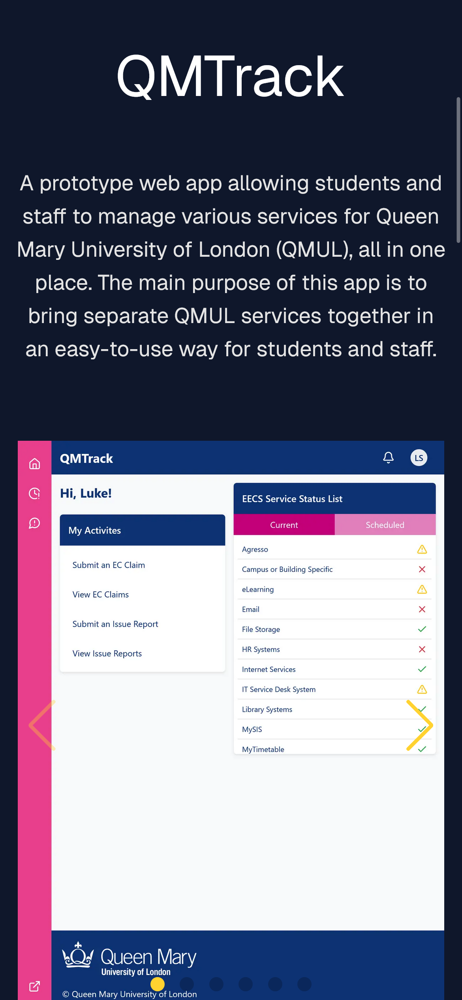

# Luke Shephard Portfolio

🔗 **Live site**: [https://lukeshephard.com](https://lukeshephard.com)

This is the source code for my portfolio, built with [Next.js](https://nextjs.org/) (App Router), [React](https://react.dev/) and [TypeScript](https://www.typescriptlang.org/).
It showcases my projects and socials.

## 📷 Screenshots
|  Page         |    Desktop                                                         |                        Mobile                                    |
| :-----------: | :----------------------------------------------------------------: | :--------------------------------------------------------------: |
|  **Homepage** | ||
|  **Projects** | ||

## 🛠️ Tech Stack

- [Next.js 13+ App Router](https://nextjs.org/docs/app)
- [React](https://react.dev/)
- [TypeScript](https://www.typescriptlang.org/)
- [Tailwind CSS](https://tailwindcss.com/)
- [Cloudflare Workers](https://developers.cloudflare.com/workers/)

## 🚀 Getting Started

1. **Clone the repo**

    ```
    git clone https://github.com/lukeshephard/portfolio.git
    cd portfolio
    ```

2. **Install dependencies**

    ```
    npm install
    ```

3. **Run the development server**

    ```
    npm run dev
    ```

    Open [http://localhost:3000](http://localhost:3000) to view it in your browser. Edits will appear live.

## ✨ Features

- **Responsive design** with light, dark and system themes to on top of the default theme.
- **Showcase of projects** with screenshots for all supported platforms, along with descriptions and links where available.
- **Accessible UI**: alt text for images and good colour contrast.
- **Fast loading**: static export served from Cloudflare's global CDN, plus optimised images.

## License: 
Code in this repository is licensed under the [MIT License](LICENSE).